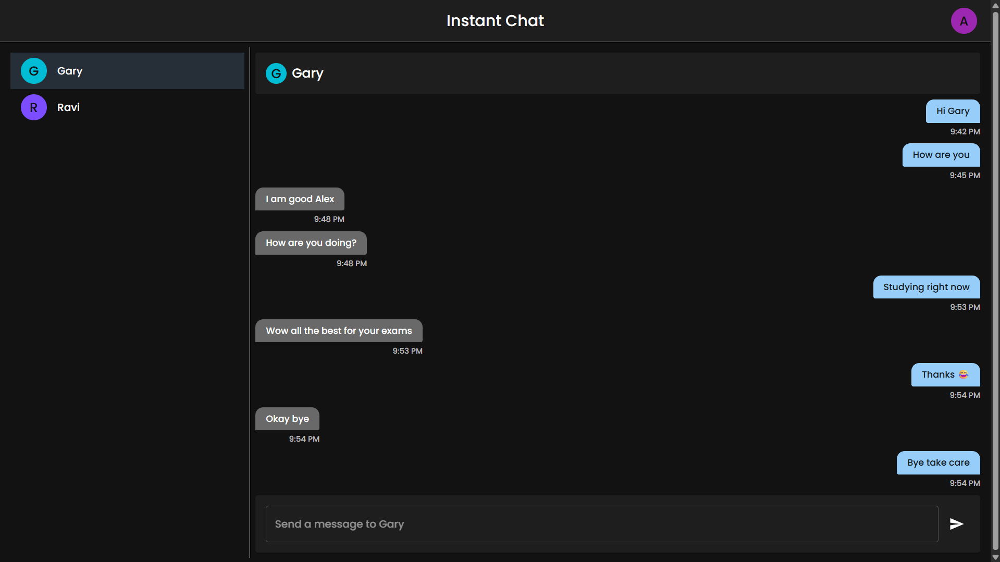

# Instant Chat

A real-time chat application with 1-to-1 messaging, user authentication, and encrypted message storage.

## Features

- Real-time messaging using WebSockets
- User registration and authentication with JWT
- 1-to-1 chat functionality
- Encrypted message storage
- Responsive UI with Material-UI
- User list with avatar display

## Tech Stack

**Backend:**

- Go with Chi router
- PostgreSQL database
- WebSocket connections
- JWT authentication
- Message encryption

**Frontend:**

- React + TypeScript
- Vite build tool
- Material-UI components
- Axios for API calls
- WebSocket client
